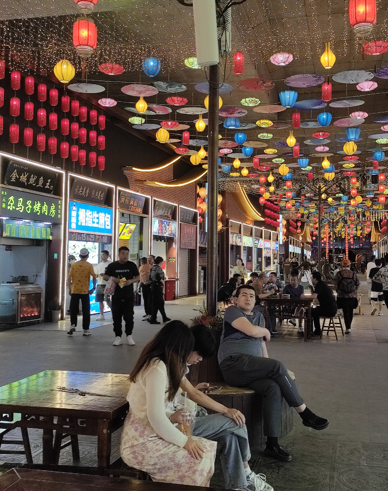

## 卷首语
兰州的夜晚，不只是灯火

兰州，这座黄河之滨的城市，有着独特的魅力。白天，它是西北的交通
枢纽，是一座现代化的省会城市。夜晚，它是一座充满生机和活力的夜经济
之城，是一座让人流连忘返的美食天堂。

在本期新闻专刊中，我们将带您走进兰州的三大夜市：正宁路夜市，大
众巷，黄河食渡文化夜市。这些夜市不仅是兰州人消费娱乐的重要场所，也
是兰州人文化和生活方式的展示窗口。在夜市里，您将看到各式各样的美食
小吃，听到摊主们的故事和心声，感受到兰州人的热情和好客。

正宁路夜市是兰州最有名气、最老牌的夜市之一，被《舌尖上的中国（第
二季）》推荐过的牛奶鸡蛋醪糟就出自这里。其历史可以追溯到上世纪 90
年代初，当时的正宁路只是一条普通的街道，但由于地处闹市，交通便利，
商业氛围浓厚，很多小摊贩就在这里摆摊做生意。最初只有几个摊位卖牛奶
鸡蛋醪糟、羊杂、烤肉等小吃。后来随着生意越做越好，越来越多的摊贩加
入进来，形成了一个规模庞大的夜市，各种烤肉、羊杂、面食、烤面筋、各
类烧烤海鲜、油炸洋芋、酿皮甜醅等美食供您选择，在这里你可以品尝到最
地道的兰州小吃，感受到最真诚的兰州人情味。正宁路夜市不仅是情感的寄
托，也是文化的传承。

大众巷是兰州另一个网红打卡地 。这里有一个地标打卡路牌“我在兰州
很想你”，吸引了无数游客前来留影。这里有梅花糕、烤冷面、铁板虾滑、
臭豆腐、软儿梨、烤肉烤鱿鱼、鸡蛋汉堡、孜然肉夹饼等特色小吃。大众巷
是明清建筑风格为主，赋予了它更多的文化内涵，并且以灯带点缀夜空，一
条又一条长长的橙色灯带悬挂在夜市上方，“星光”闪闪如同银河。大众巷
夜市不仅是味觉的盛宴，也是视觉的享受。

黄河食渡文化夜市是今年 3月开业的新晋夜市。这里以文化开路，在夜经济中嵌入文化芯。这里内设长安街、秦州街、兰州街、凉州街、西域文化街五个主题街区，每个街区相对应不同的特色。这里还有四个微舞台为游客提供沉浸式体验项目，如骞巡游、玄奘西行、飞天琵琶舞等。这里的主舞台“兰州眼”，将声、光、电充分融合，每天排演不同的节目，既有古风的舞蹈表演，也有国潮的音乐鉴赏。黄河食渡文化夜市不仅是创意的展现，也是历史的回响。兰州的夜晚，不只是灯火。它是一座城市的灵魂和脉搏。让我们一起探索这座城市的另一面吧！

[ahkevinxy](/images/111.png)

## 老中青三代夜市 : 烟火经济助力兰州发展

夜市历史悠久，在唐代后期的大城市中就已出现。现今夜市所指
为夜间做买卖的市场，主要销售杂货、饮食小吃等商品，在我国大陆
及台湾、香港等地更是平民生活文化的重要代表之一。党的二十大报告、
2023 政府工作报告中多次提到适时扩大内需战略，中央经济工作报告
更是将扩大内需放在五大任务之首，提出增强消费能力、创造消费场
景等明确要求，而夜市经济
作为一种新消费、新场景、
新体验，已经逐步成为人们
热潮的消费方式。兰州市城
建部也大力推行夜市经济发
展，助力兰州经济发展、城
市建设。

黄河第一桥？白塔入云
间？这些仅仅只是城市的标
签。城市的文化，浓缩在城
市的大街小巷之中，埋藏在
本地人的日常生活里。而夜
市，则是劳累的人们最佳的去处，是最贴近城市底蕴的地方。夜市的
热闹繁华总是让人沉醉其中，每一次走在夜市的小巷里，总会让我感
到无限的欢愉和兴奋。熟悉的摊位和摊主们的笑脸总是让人们感到亲
切和舒适，夜市已成为我们生活的一部分。夜市是来自各地的人们观
察兰州的一个窗口，也是兰州经济文化的一个缩影。

## 正宁路夜市

### 品尝陇原特色美食，展现民族文化魅力

正宁路作为兰州市历史韵味最浓、民族特色最重的夜市，是集中了陇原各地特色小吃的美食街，也是兰州市打造的夜市经济的重要载体

正宁路夜市位于双城门到南关十
字的庆阳路的南端，整条小吃街大
概有 200 米左右，两边全是中国北方
的小吃。大概有 20多种，主要都是炸，
烤，炒，煮，之类的，例如：油炸洋芋，
各式烧烤，烤羊肉，烤鱼，烤鱿鱼，
山东煎饼，炒海鲜，炒面，鸡蛋醪糟，
酸汤饺子，兰州凉皮，陕西擀面皮，
腊肉夹馍等。每当夜幕降临，夜市便开始沸腾起来。啤酒、烤肉、牛奶鸡蛋醪糟、炒面、羊杂、酿皮、甜醅…… 满足着“吃货”们的味蕾，为市民和游客提供了一个接地气的餐饮、休闲之地。

### 民族风情

   不同于其他地区人们很少去的网红回民街，正宁路作为兰州
人气最旺的夜市，本地人甚至比
游客还爱去逛，对于游客来说这
里是景点，对于本地人来说这里
则是生活，人声鼎沸的正宁路夜
市里飘荡着的正是属于兰州的人
间烟火气。走进正宁路夜市，细
细看去，整条街上有数十个白胡飘飘的“老马爷”，你不知道哪位才是正宗的“老马爷”，但并不妨碍每个摊位前都排着长长的队，等待着一碗热气腾腾的牛奶鸡蛋醪糟。

不难发现，这里的许多小摊都是由回族人民开设的，在人群中也可以看到有不少带着“白帽”的回族朋友在闲逛聊天、品尝美食。回族人民是血勇豪迈的，做起生意来也是热情爽快的，相比于其他摊主，可以感受到他们不一样的激情。西北人民喜爱的羊头羊杂，在他们手上能发挥出食物的原汁原味。

### “热辣滚烫”肚包肉

放眼望去，正宁路上全是特色小吃美食，让人目不暇接，不知道该从何切入。

如果您也是如此这般，那不妨试试正宁路的人气美食——肚包肉。又辣又烫的肚包肉作为西北地区的特色风味，吸引了不少本地人和外地游客。肚包肉是一种将羊肚切开，塞入羊肉、羊油、香料等，再用针线缝合，放入锅中煮熟的特色菜。吃的时候，将肚包肉切成薄片，蘸上辣椒酱、芝麻酱、醋等调料，一口咬下去，香嫩多汁，鲜辣爽口。肚包肉作为新疆特色美食出现在《舌尖上的中国》第二季中，于纪录片《新疆味道》中也有详细介绍。吃肚包肉不仅能品尝到羊肉的鲜美，还能感受到羊肚的弹性和香料的馥郁。吃肚包肉还能暖胃驱寒，增强体质，适合冬季食用。正宁路的肚包肉是兰州美食街上的一道亮丽风景线，也是兰州人民对游客的一份热情款待。如果你来到兰州，一定要去正宁路尝尝这道地道的美味佳肴。

## 大众巷星光夜市

## 打造夜间文化旅游消费新地标 

  我在兰州很想你”“世界那
么大，我只想去大众巷看看，大众巷新光夜市欢迎您”“我们如此热爱兰州，那些年记忆力的兰州——有你”

    兰州大众巷，位于兰州市中心，
与张掖路步行街相交，一条美食街，也是兰州知名的特
色夜间文旅消费集聚区。这里集中
的一条美食街，也是兰州知名的特
了多家在兰州声望很高的老字号，
如“灰豆王”、“马子禄牛肉面”、
“茹记烤肉”、“金城炒面片”、“高
担凉皮”等等，价位也合适，小吃
味道都还可以。夜幕降临，大众巷
热闹非凡。从步行街进入大众巷，
首先映入眼帘的是一幅巨大的壁画，
上面写着“甘肃美食”四个大字，
背景是兰州的城市地标——黄河铁
桥。壁画下方是一排排整齐有序的
摊位，卖着各式各样的商品和小吃。
摊主们热情招呼着顾客，顾客们或
驻足观看，或品尝美食，或拍照留念，
一派繁荣景象。

### “星光大道”

“市井长巷，聚拢来是烟火，
摊开来是人间。”人间烟火气最能
抚慰人们的心灵，每当经过一条温
暖、人多的小巷，总会被这种朴素
的热闹给治愈，生活不是纸醉金迷，
而是那万家灯火中最平凡的日子。
走进大众巷夜市，首先吸引人的不
是那美味的小吃，而是从头到尾灿
若星河的星光灯带，暖暖地星光灯
带笼罩着一整条街，心里也是暖暖
地，每一个小灯就好比我们的生活
一般，由每一个稀松平常的日子组
成，寓意着每一天都要生活得开心、
舒服，把平凡的一天过得不平凡。
在大众巷星光夜市，抬头可以看“星
光”、低头可以享受来自全国各地
不同的美食，除了西北特色美食之
外，不管是海南的清凉补还是云南
的竹筒饭、印度的飞饼在这里都可
以找到，夜市上空长长的灯带闪烁
着暖暖的光亮，氛围感满满，让你
能够在大众巷沉浸式享受美味，这
也正是大众巷夜市的特色之一。

### 甜甜的牛奶鸡蛋醪糟

牛奶鸡蛋醪糟是一种用牛奶、
鸡蛋和米制成的甜品。制作方法不
难，先将米浸泡后捣碎成米浆，在
锅中加水加糖加牛奶加鸡蛋搅拌均
匀后用小火慢慢熬制成稠稠的白色
液体。然后将液体倒入碗中放凉后
就可以食用了。牛奶鸡蛋醪糟口感
绵软香甜，营养丰富。也曾被《舌
尖上的中国（第二季）》所推荐 ，
已成为响当当的网红打卡名小吃。
据说这种甜品最早是由清朝时期的
回族商人从西域带回来的，在兰州
传承了几百年，是兰州人的传统美
食。所以每个牛奶鸡蛋醪糟摊前都
排着长长的队伍，因为这是只有在
兰州才能吃到的特色。

###  明清仿古风建筑

兰州大众巷的建筑特色是以明清
仿古和新中式风格为主，运用青砖
瓦、木圆柱、砖雕等元素，营造出
古典优雅的氛围，走进大众巷就感觉走进了一座小古城。夜市大门
是木质仿古牌坊，沿街的雕塑、地
雕装置上，都镌刻着历史文化名
人、街巷故事以及甘肃省每个城市
分部的方位，在夜市门口的墙壁上
还装有用古铜颜料绘制的古代西北
的城市图，给人一种历史感，大众
巷不仅对外观进行了美化，还对地
下管网、路面铺设、亮化线路等基
础设施进行了改造，提升了街区的
整体环境。大众巷是兰州市城关区
的一条历史文化美食街区，按照国
家 4A 级景区标准进行提升改造，
如今形成了“一庙”“一街”“三区”
的格局。

## 黄河食渡文化夜市：

### 一座沉醉于黄河文化的“消费码头”

兰州，一座因黄河而兴的城市，也是丝绸之路上的重要驿站。这里
有着悠久的历史文化，也有着独特的饮食风味。在这里，你可以品尝到
牛肉面、羊杂、酿皮、醪糟等地道的美食，也可以感受到黄河文化、丝
路文化、边塞文化等多元的文化氛围。

为了进一步展示兰州的城市魅力，提升夜间经济发展水平，今年 3
月 18 日，兰州市在黄河之滨打造了一座集美食、旅游、购物、文旅体
验为一体的主题夜经济——“黄河食渡文化夜市”。这是一座以黄河为
灵魂，以丝绸之路为主线，以食为媒介，以文化为内涵的“消费码头”，
让游客在品尝美食的同时，也能沉醉于黄河文化和丝路文化的魅力。

### 五个主题街区展现丝路风情

黄河食渡文化夜市是一座集丝
绸之路文化、黄河文化、甘肃风情
于一体的特色夜市，位于兰州市城
关区元通黄河大桥北引桥下与靖远
路交会处，与黄河仅一路之隔，往
西 400 米就是白塔山、黄河铁桥。
夜市内呈“T”字形分布，内设长
安街、天水陇东街、兰州街、河西
走廊（敦煌）街、西域文化街等 5
个丝绸之路节点城市街区，每个街
区相对应不同的特色，让游客在品
尝美食的同时，感受历史的魅力和
文化的多样性。

长安街是夜市的起点，以大唐
仿古建筑为主，展现了长安城的繁
华盛景。这里有国家级非物质文化遗产泾阳茯茶、长安烤肉、长
安炒面等特色美食，也有唐诗宋词、
唐装秀等文化表演。泾阳茯茶是一
种用茯苓和茶叶熬制而成的药茶，
具有清热解毒、健脾利湿的功效，
是唐代宫廷贡品。长安烤肉是一种
用羊肉或牛肉切成薄片，用秘制酱
料腌制后，用铁钎穿好，在炭火上
烤制而成的美食，香嫩可口，是唐
代士人雅集的佳肴。长安炒面是一
种用手工拉面切成细丝，用油炸后，
再用酱汁和蔬菜炒制而成的美食，
酥脆爽口，是唐代民间的常见食品。
在这里，游客可以一边品尝这些美
食，一边欣赏唐诗宋词的朗诵和唐
装秀的展示，感受唐代文人的风雅
和唐代服饰的华丽。

天水陇东街是夜市的中段，以
陇东窑洞为主题，展现了甘肃东部
地区的民俗风情。这里有天水羊肉
泡馍、陇东粮仓、红色文化等特色
元素，也有陇东民歌、陇东舞蹈等
民俗活动。天水羊肉泡馍是一种用
羊肉汤浸泡馍块，并加入羊肉丁和
香菜等佐料的美食，鲜香浓郁，是
甘肃东部地区的特色小吃。陇东粮
仓是一种用各种谷物制成的粮食产
品，如玉米面、高粱面、小米面等，
富含营养，是甘肃东部地区的主要
粮食来源。红色文化是指甘肃东部
地区在革命时期所发生的历史事件
和人物故事，如西路军、红军长征
等，具有深刻的教育意义。在这里，
游客可以一边品尝这些美食，一边
观看陇东民歌和陇东舞蹈的表演，
感受陇东人民的朴实和勇敢。

兰州街是黄河食渡文化夜市的
核心区域，以兰州水车为标志，展
现了兰州作为黄河母亲城市的特
色。这里有牛肉面、羊杂、酿皮等
兰州美食，也有兰州太平鼓、兰州
花儿等非物质文化遗产。肉面是一
种用牛肉和面条煮成的汤面，汤清
味浓，面条劲道，是兰州的名片和
代表美食。羊杂是一种用羊内脏切
成小块，用香料熬制而成的汤菜，
鲜香不腥，是兰州的特色菜肴。酿
皮是一种用豆腐皮做成的皮子，里面包裹着肉末、粉丝等馅料，
再用辣椒油、醋等调味品拌匀而成
的凉菜，爽口开胃，是兰州的传统
小吃。在这里，游客可以一边品尝
这些美食，一边欣赏兰州太平鼓和
兰州花儿的演奏，感受兰州的音乐
和民俗。

河西走廊（敦煌）街是黄河食
渡文化夜市的西段，以敦煌壁画为
主题，展现了河西走廊的文化底蕴。
这里有敦煌酥饼、敦煌烤肉、敦煌
酸奶等敦煌美食，也有敦煌飞天、
敦煌乐舞等敦煌艺术。敦煌酥饼是
一种用面粉和油制成的饼干，外形
像月亮，口感酥脆，是敦煌的特产
和礼品。敦煌烤肉是一种用羊肉或
牛肉切成小块，用秘制酱料腌制后，
在木炭火上烤制而成的美食，外焦
里嫩，香气四溢，是敦煌的经典美食。
敦煌酸奶是一种用牛奶或羊奶发酵
而成的乳制品，口感绵滑，酸甜适中，
是敦煌的传统小吃。在这里，游客
可以一边品尝这些美食，一边观看
敦煌飞天和敦煌乐舞的表演，感受
敦煌的艺术和神秘。

西域文化街是黄河食渡文化夜
市的终点，以西域风情为主题，展
现了丝绸之路上的异域风光。这里
有新疆大盘鸡、新疆手抓饭、新疆
馕等新疆美食，也有新疆歌舞、新
疆服饰等新疆文化。新疆大盘鸡是
一种用鸡肉和土豆切成大块，用香
料和辣椒炖制而成的菜肴，色泽红
亮，味道浓郁，是新疆的招牌菜。
新疆手抓饭是一种用羊肉和胡萝卜
炒制后，再和米饭一起蒸煮而成的
饭菜，香气扑鼻，肉饭相融，是新
疆的主食。新疆馕是一种用面粉和
水和成的面团，再在馕坑里烤制而
成的面包，外皮金黄，内部松软，
是新疆的特色面食。在这里，游客
可以一边品尝这些美食，一边欣赏
新疆歌舞和新疆服饰的展示，感受
新疆的风情和多彩。

### 四个舞台呈现文化精彩

在“T”字形街区的交汇处，就
是黄河食渡文化夜市的主舞台“兰
州眼”，舞台将声、光、电充分融合，
每天排演不同的节目，既有古风的
舞蹈表演，也有国潮的音乐鉴赏。
在舞台周围，还设有四个微舞台，
分别对应四个主题街区，展示各自
的文化特色。

在长安街的微舞台上，游客可
以欣赏到唐诗宋词的朗诵，感受到
古代文人的雅致情怀。在天水陇东街的微舞台上，游客可以欣赏到陇
东民歌的演唱，感受到陇东人民的
淳朴风情。在兰州街的微舞台上，
游客可以欣赏到兰州太平鼓的表演，
感受到兰州人民的幽默智慧。在河
西走廊（敦煌）街的微舞台上，游
客可以欣赏到敦煌飞天的舞蹈，感
受到敦煌艺术的神秘美丽。

### 一座消费码头促进夜市经济

据黄河食渡文化夜市负责人介
绍，黄河食渡文化夜市总占地面积
约 17000 平方米，五个主题街区共
设立标准化摊位 166 个，全部采用
电烤、电煮、电烹等用电形式运营，
无明火、无天然气。夜市内部分布
有公共厕所、垃圾分类桶、消防设
施等配套设施，保障了夜市的安全
和卫生。

黄河食渡文化夜市旨在打造一
个集美食、旅游、购物、文旅体验
为一体的主题夜经济，街区在功能
上除有集中售卖特色美食、非遗类
文化文创产品外，还根据街区独特
的地域文化设计，涉透多种形式的
传统文化、现代艺术、街头艺术、
行为艺术、网红打卡等文化商旅展
演活动。街区还计划在法定节假日
不定期举办文化推介、创意集市、
酒文化节、美食嘉年华、露天电影、
民俗服装秀等主题活动。

黄河食渡文化夜市不仅为兰州市民提供了一个休闲娱乐的好去
处，也为兰州旅游增添了一道亮
丽的风景线。夜市以黄河为灵魂，
以丝绸之路为主线，以食为媒介，
以文化为内涵，让游客在品尝美
食的同时，也能沉醉于黄河文化
和丝路文化的魅力。夜市以创新
的形式，传承和弘扬了兰州的历
史文化，也展示了兰州的城市形
象和发展活力。

黄河食渡文化夜市是兰州夜
间经济的一个缩影，也是兰州文
化旅游消费的一个新地标。它为
兰州经济发展助力，为本土文化
灌注新鲜的血液，力争成为一个
崭新的文化地标。

